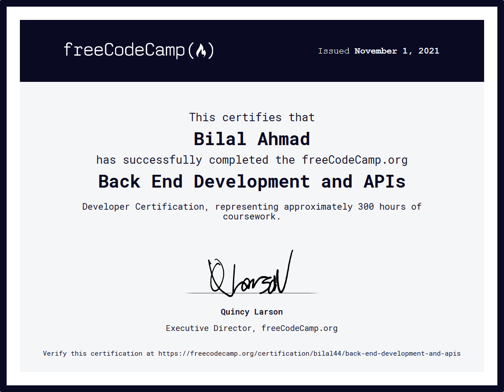

# FCC Microservice API Projects

Five projects developed for FreeCodeCamp's 'Back End Development and APIs' online course.

- Timestamp Microservice :heavy_check_mark:
- Request Header Parser Microservice :heavy_check_mark:
- URL Shortener Microservice :heavy_check_mark:
- Exercise Tracker (Full Stack) :heavy_check_mark:
- File Metadata Microservice :heavy_check_mark:

 

<a href="https://www.freecodecamp.org/certification/bilal44/back-end-development-and-apis" title="FCC Backend Development & API Certificate">

</a>